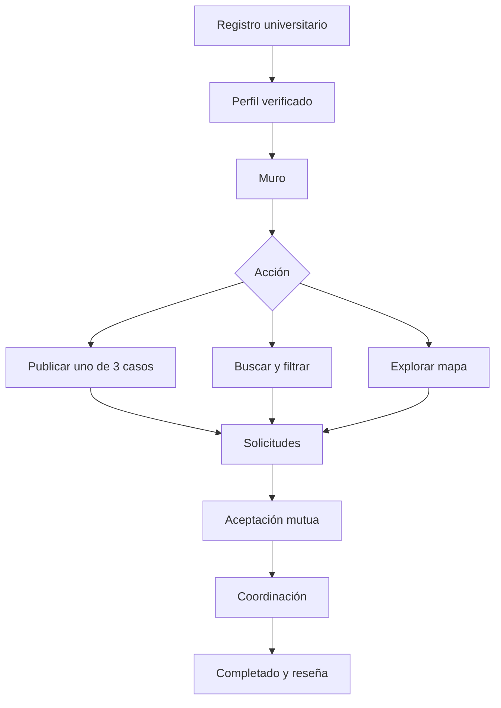
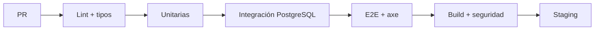

# Greenmove — Plan maestro de producto, arquitectura, agentes, pruebas y despliegue

> Plan ejecutable para construir Greenmove con Codex Desktop y Claude Code, a partir de la estructura RAITE Campus y el estilo del ZIP de Stitch.

## 0. Resumen ejecutivo

Greenmove será una aplicación universitaria mobile-first para coordinar traslados entre estudiantes mediante un muro comunitario. Su valor no es “competir con Uber”, sino hacer visibles tres situaciones que ya ocurren:

1. Una persona ya irá en Uber y quiere compartir el costo.
2. Una persona tiene auto y puede acercar compañeros mediante paradas y cooperación voluntaria.
3. Una persona necesita que alguien pase por ella.

La versión evaluable debe ser una web responsive instalable (PWA), con API y base de datos reales, y preparada para empaquetarse con Capacitor. Debe funcionar en móvil antes que en escritorio, ser demostrable con datos semilla y no depender de servicios caros.

### Definición de terminado del MVP

Un estudiante puede registrarse con correo universitario verificado, completar su perfil, publicar cualquiera de los tres casos, buscar/filtrar publicaciones, verlas en muro y mapa, enviar una solicitud, aceptar/rechazar solicitudes, coordinarse por chat o WhatsApp, marcar el trayecto como completado, dejar reseña y consultar impacto de CO₂. Todo tiene permisos, validación, pruebas y estados de interfaz.

---

## 1. Hallazgos de los ZIP analizados

### Estructura base

El ZIP base contiene:

- `frontend/`: Vue 3, Vite, Ionic Vue, vistas de login, registro, inicio, crear publicación y perfil.
- `backend/`: Spring Boot con modelos/controladores/servicios/repositorios iniciales.
- `database/`: `schema.sql` y datos de prueba, todavía como tareas pendientes.
- `docs/`: API, reglas, tareas y primer commit.
- `setup.ps1`: arranque para Windows.

La estructura sirve, pero no es una aplicación terminada: faltan modelo relacional, seguridad real, contrato API, tests, mapa, chat, estados y despliegue.

### Diseño Stitch

El ZIP de Stitch aporta diez conceptos de pantalla:

- Inicio/muro.
- Búsqueda del muro.
- Mapa de raites en Morelia.
- Publicar “Comparto Uber”.
- Publicar “Tengo auto”.
- Publicar “Necesito raite”.
- Viaje confirmado.
- Chat en vivo.
- Perfil universitario.
- Historial de chats y trayectos.
- Logo Greenmove.

Su estilo es **Neo-Brutalist Pop Universitario**:

| Token | Valor base |
|---|---|
| Fondo | `#FEFCE8` marfil cálido |
| Amarillo principal | `#FACC15` |
| Amarillo suave | `#FEF08A` |
| Morado | `#8127CF` / `#A855F7` |
| Verde | `#22C55E` / `#006E2F` |
| Texto | `#0F172A` |
| Bordes | negro, 2–3 px |
| Sombra | `4px 4px 0 #000` |
| Tipografía | Plus Jakarta Sans 600–900 |
| Radio | 8–16 px según jerarquía |

### Regla de réplica

Replicar el **lenguaje visual**, no copiar las páginas HTML literalmente. El HTML de Stitch usa Tailwind por CDN, contenido fijo e imágenes remotas; producción requiere componentes Vue, tokens locales, datos reales, carga diferida, accesibilidad y pruebas.

---

## 2. Producto y vocabulario oficial

### Actores

- **Estudiante**: cualquier cuenta verificada.
- **Autor de publicación**: quien publica uno de los tres casos.
- **Solicitante**: quien responde a una publicación.
- **Participante**: cuenta aceptada en un trayecto.
- **Moderador**: revisa reportes; no gestiona pagos.

Evitar en UI: “chofer profesional”, “cliente”, “tarifa cobrada”, “ganancias”.

Usar: “compañero”, “persona que publica”, “cooperación sugerida”, “dividir costo”, “lugares disponibles”.

### Tres tipos inmutables

| Código | Etiqueta visible | Datos exclusivos | CTA |
|---|---|---|---|
| `UBER_SPLIT` | Comparto Uber | costo estimado, número de personas, hora límite | “Quiero compartir” |
| `OWN_CAR` | Tengo auto | lugares, vehículo básico, paradas, cooperación sugerida | “Solicitar lugar” |
| `RIDE_REQUEST` | Necesito raite | urgencia, cooperación ofrecida, equipaje/preferencias | “Puedo pasar por ti” |

### Fuera del alcance del MVP

- Pagos, wallet, comisiones o retención de dinero.
- Seguimiento GPS continuo.
- Verificación gubernamental de identidad.
- Optimización automática de rutas con IA.
- Marketplace de conductores.
- Viajes anónimos o cuentas no universitarias.

---

## 3. Experiencia móvil y pantallas

### Navegación inferior

1. **Muro**
2. **Mapa**
3. **Publicar** (acción central dominante)
4. **Actividad**
5. **Perfil**

### Flujo principal



### Inventario de pantallas

| # | Pantalla | Contenido clave | Estados obligatorios |
|---|---|---|---|
| 1 | Splash/onboarding | Propuesta y seguridad | primera vez / recurrente |
| 2 | Login | correo, contraseña, recuperación | error, bloqueo, cargando |
| 3 | Registro | correo universitario, código, términos | dominio inválido, expirado |
| 4 | Perfil inicial | nombre, campus, foto opcional, contacto | permiso foto, incompleto |
| 5 | Muro | feed mixto y filtros | loading, vacío, error, offline |
| 6 | Buscar | origen, destino, fecha, tipo | sin resultados, recientes |
| 7 | Mapa | pines por tipo y bottom sheet | permiso negado, sin mapa |
| 8 | Selector publicar | 3 tarjetas claramente distintas | — |
| 9 | Publicar Uber | ruta, hora, costo y lugares | validación/previsualización |
| 10 | Publicar auto | ruta, paradas, lugares y cooperación | validación/previsualización |
| 11 | Pedir raite | ruta, urgencia, cooperación/preferencias | validación/previsualización |
| 12 | Detalle | autor, confianza, ruta, condiciones | cerrada, llena, propia |
| 13 | Solicitudes | aceptar/rechazar | vacía, expirada |
| 14 | Trayecto activo | estado, participantes, contacto | cancelado, completado |
| 15 | Chat | mensajes breves y acciones rápidas | offline, reintento |
| 16 | Actividad/historial | pendientes, activos, pasados | vacío |
| 17 | Perfil público | reputación, verificaciones, historial | restringido |
| 18 | Ajustes/seguridad | privacidad, bloqueos, reportes | confirmaciones |
| 19 | Reseña/reporte | calificación, etiquetas, comentario | enviado/error |
| 20 | Panel moderación mínimo | reportes y estado | acceso prohibido |

### Reglas contra layouts genéricos

- El muro no será una cuadrícula de dashboard: será una secuencia editorial móvil con tarjetas asimétricas por tipo.
- Cada tipo tendrá silueta y color-acento distinguible, no solo un badge.
- La acción “Publicar” abre un selector de tres casos con lenguaje humano.
- El mapa usa pines personalizados amarillo/morado/verde y un bottom sheet de alto contraste.
- Los datos de confianza aparecen junto a la decisión, no escondidos en el perfil.
- El impacto ambiental es contextual y honesto; nunca inventar cifras sin fórmula documentada.
- Animaciones: presionar desplaza 2–4 px y elimina sombra; respetar `prefers-reduced-motion`.

---

## 4. Sistema de diseño Greenmove

### Tokens obligatorios

Crear `frontend/src/styles/tokens.css` y reflejarlos en Tailwind:

```css
:root {
  --gm-surface: #fefce8;
  --gm-surface-strong: #fef08a;
  --gm-yellow: #facc15;
  --gm-purple: #8127cf;
  --gm-purple-soft: #f3e8ff;
  --gm-green: #22c55e;
  --gm-green-soft: #dcfce7;
  --gm-ink: #0f172a;
  --gm-danger: #ef4444;
  --gm-border: 2.5px solid #000;
  --gm-shadow-sm: 2px 2px 0 #000;
  --gm-shadow-md: 4px 4px 0 #000;
  --gm-radius-sm: 8px;
  --gm-radius-md: 12px;
  --gm-radius-lg: 16px;
}
```

### Componentes base antes de pantallas

1. `GmButton`
2. `GmIconButton`
3. `GmField`
4. `GmSelectChip`
5. `GmNotice`
6. `GmBottomSheet`
7. `GmAvatarTrust`
8. `GmRouteTimeline`
9. `GmPublicationCard` con tres variantes
10. `GmEmptyState`
11. `GmSkeleton`
12. `GmStatusBadge`
13. `GmImpactWidget`
14. `GmBottomNav`

Cada componente debe tener Storybook con normal, hover, focus, pressed, disabled, loading, error y responsive cuando aplique.

### Accesibilidad

- Objetivos táctiles mínimos de 44×44 px.
- Foco visible negro/morado, nunca solo cambio de color.
- Labels reales, no placeholders como etiqueta.
- Contraste WCAG AA.
- Navegación completa con teclado.
- Anunciar cambios de solicitud/chat con regiones `aria-live` moderadas.
- Respetar texto ampliado 200% y `prefers-reduced-motion`.

---

## 5. Arquitectura del repositorio

```text
greenmove/
├── AGENTS.md
├── CLAUDE.md
├── .env.example
├── compose.yaml
├── frontend/
│   ├── src/
│   │   ├── app/
│   │   ├── assets/
│   │   ├── components/{base,domain,layout}/
│   │   ├── composables/
│   │   ├── features/{auth,feed,publications,requests,trips,chat,profiles,reviews}/
│   │   ├── router/
│   │   ├── services/
│   │   ├── stores/
│   │   ├── styles/
│   │   ├── types/
│   │   └── views/
│   ├── tests/
│   └── stories/
├── backend/
│   └── src/
│       ├── main/java/mx/edu/greenmove/
│       │   ├── auth/
│       │   ├── common/
│       │   ├── publication/
│       │   ├── request/
│       │   ├── trip/
│       │   ├── chat/
│       │   ├── profile/
│       │   ├── review/
│       │   └── moderation/
│       ├── main/resources/db/migration/
│       └── test/
├── database/
│   ├── seed/
│   └── diagrams/
├── docs/
│   ├── PRODUCT.md
│   ├── DESIGN_SYSTEM.md
│   ├── DECISIONS.md
│   ├── HANDOFF.md
│   ├── TASKS.md
│   └── openapi.yaml
└── .github/workflows/
```

### Arquitectura backend

Usar módulos por feature, no carpetas globales gigantes. Dentro de cada feature:

```text
publication/
├── api/          # controller + DTO
├── application/  # casos de uso
├── domain/       # reglas/entidades
└── infrastructure/ # JPA/adaptadores
```

Para el proyecto escolar no hace falta microservicios. Un monolito modular es más demostrable, barato y fácil de probar.

---

## 6. Modelo de datos

### Entidades principales

| Tabla | Campos esenciales |
|---|---|
| `universities` | id, name, slug, allowed_domains, active |
| `users` | id, university_id, email, password_hash, email_verified_at, status, created_at |
| `profiles` | user_id, display_name, avatar_url, campus, bio, phone_visibility, rating_avg, rating_count |
| `vehicles` | id, user_id, make, model, color, plate_last4, seats, verified_at |
| `publications` | id, author_id, type, status, origin, destination, departure_at, expires_at, seats, contribution, notes, women_only, verified_only, version |
| `publication_stops` | id, publication_id, position, label, point |
| `ride_requests` | id, publication_id, requester_id, message, seats, status, created_at |
| `trips` | id, publication_id, status, started_at, completed_at, cancelled_reason |
| `trip_participants` | trip_id, user_id, role, status |
| `conversations` | id, trip_id, created_at |
| `messages` | id, conversation_id, sender_id, body, created_at, read_at |
| `reviews` | id, trip_id, reviewer_id, reviewed_id, rating, tags, comment |
| `reports` | id, reporter_id, target_type, target_id, reason, details, status |
| `blocks` | blocker_id, blocked_id, created_at |
| `notifications` | id, user_id, type, payload_json, read_at, created_at |
| `refresh_tokens` | id, user_id, token_hash, expires_at, revoked_at |

### Reglas críticas de datos

- `publications.type` solo admite los tres códigos.
- `UBER_SPLIT` necesita costo y lugares; `OWN_CAR` necesita lugares; `RIDE_REQUEST` puede no tener lugares.
- Autor y solicitante no pueden ser la misma persona.
- Una solicitud activa por estudiante/publicación.
- No aceptar más lugares de los disponibles; usar transacción y bloqueo optimista.
- Reseña única por par de usuarios y trayecto.
- Mensajes solo para participantes aceptados.
- Coordenadas se guardan como `geography(Point,4326)`; no publicar ubicación doméstica exacta en el muro.
- Borrado lógico para publicaciones/reportes; retención documentada.

### Estados

```text
Publication: DRAFT → PUBLISHED → FULL/CLOSED/EXPIRED/CANCELLED
Request: PENDING → ACCEPTED/REJECTED/CANCELLED/EXPIRED
Trip: CONFIRMED → EN_ROUTE → ARRIVED → COMPLETED/CANCELLED
```

---

## 7. Contrato API mínimo

Base: `/api/v1`.

### Auth/perfil

- `POST /auth/register`
- `POST /auth/verify-email`
- `POST /auth/login`
- `POST /auth/refresh`
- `POST /auth/logout`
- `GET /me`
- `PATCH /me/profile`
- `GET /profiles/{id}`

### Publicaciones

- `GET /publications?type=&origin=&destination=&from=&radius=&cursor=`
- `POST /publications`
- `GET /publications/{id}`
- `PATCH /publications/{id}`
- `POST /publications/{id}/close`
- `GET /publications/map?bbox=&type=`

### Solicitudes/trayectos

- `POST /publications/{id}/requests`
- `GET /publications/{id}/requests`
- `POST /requests/{id}/accept`
- `POST /requests/{id}/reject`
- `GET /trips/{id}`
- `POST /trips/{id}/status`
- `POST /trips/{id}/cancel`

### Chat/reseñas/seguridad

- `GET /trips/{id}/messages?cursor=`
- `POST /trips/{id}/messages`
- `POST /trips/{id}/reviews`
- `POST /reports`
- `POST /blocks/{userId}`
- `GET /notifications`
- `POST /notifications/{id}/read`

Todos los errores usan un formato común:

```json
{
  "code": "PUBLICATION_FULL",
  "message": "Ya no hay lugares disponibles.",
  "fieldErrors": {},
  "traceId": "..."
}
```

---

## 8. Multiagentes: organización y propiedad

### Regla principal

Paralelizar por módulos que no comparten archivos. Máximo 4 agentes activos en el MVP; más agentes aumentan conflictos y tokens.

| Agente | Herramienta/modelo | Propiedad | No puede tocar |
|---|---|---|---|
| A0 Arquitecto/integrador | Codex Sol/Astra puntual | contratos, decisiones, integración | UI detallada sin tarea |
| A1 Datos/backend | Codex Sol | migraciones, dominio, API, tests backend | tokens/componentes |
| A2 Sistema visual | Claude Sonnet | tokens, base components, Storybook | DB/API |
| A3 Features frontend | Claude Sonnet | vistas/features y tests UI | contratos sin aprobación |
| A4 QA/accesibilidad | Codex Luna/Sol | Playwright, axe, Lighthouse, reporte | cambiar requisitos |
| A5 Seguridad/revisión | Codex Sol o Claude Opus | revisión del diff y amenazas | implementar features nuevas |

### Protocolo de tarea

Cada entrada de `docs/TASKS.md`:

```markdown
## GM-### — Título
Owner: A2 / Claude
Branch: claude/gm-###
Reads: [rutas]
Writes: [rutas]
Depends on: [IDs]
Acceptance:
- Given/When/Then...
Commands:
- npm run test -- ...
- npm run build
Handoff:
- docs/HANDOFF.md
```

### Protocolo de relevo

```markdown
## GM-### handoff
- Resultado:
- Archivos cambiados:
- Contratos usados:
- Pruebas ejecutadas y resultado:
- Capturas/rutas Storybook:
- Riesgos o deuda:
- Próxima tarea desbloqueada:
```

### Integración

1. Rebase/actualizar desde `main` antes de abrir PR.
2. CI en verde.
3. Revisión de un agente distinto al implementador.
4. Squash merge con ID de tarea.
5. Borrar rama solo después de verificar `main`.

---

## 9. Fases de ejecución

### Fase 0 — Congelar alcance (0.5 día)

- Crear fuentes de verdad y vocabulario.
- Confirmar dominios universitarios reales con el profesor/equipo.
- Definir datos ficticios de demo.
- Resultado: `PRODUCT.md`, `DECISIONS.md`, `TASKS.md`.

**Puerta:** los tres tipos y exclusiones están aprobados.

### Fase 1 — Repositorio y automatización (1 día)

- Renombrar proyecto a Greenmove.
- Migrar frontend a TypeScript sin reescritura total.
- Configurar formatter, lint, tests y CI.
- Crear Docker Compose con PostgreSQL/PostGIS.
- Añadir `.env.example` y gestión de secretos.

**Puerta:** clon limpio → un comando → frontend, backend y DB arrancan.

### Fase 2 — Sistema visual (2 días)

- Extraer tokens de Stitch.
- Construir componentes base y Storybook.
- Diseñar los tres tipos de tarjeta y selector publicar.
- Validar contraste, foco, 360/390/430 px.

**Puerta:** ningún componente usa valores visuales arbitrarios.

### Fase 3 — Base de datos y contrato (2 días)

- ERD y migraciones V1–V4.
- OpenAPI y DTOs.
- Seeds con cuentas, publicaciones y estados variados.
- Tests de constraints y repositorios con Testcontainers.

**Puerta:** DB se crea desde cero y las pruebas corren dos veces sin variación.

### Fase 4 — Autenticación/perfil (2 días)

- Registro, verificación, login/refresh/logout.
- Lista configurable de dominios universitarios.
- Rate limits y mensajes que no revelan cuentas.
- Perfil y vehículo opcional.

**Puerta:** correo externo falla en servidor; sesión expirada se recupera o cierra limpiamente.

### Fase 5 — Muro y publicaciones (3 días)

- Crear/editar/cerrar los tres tipos.
- Feed cursor-based, filtros y tarjetas.
- Detalle y compartir enlace.
- Estados loading/empty/error/offline.

**Puerta:** E2E de cada tipo desde publicar hasta verlo en feed.

### Fase 6 — Mapa y búsqueda (2 días)

- MapLibre, geocodificación seleccionada y pines por tipo.
- Privacidad por aproximación de ubicación.
- Bottom sheet y fallback de lista si el mapa falla.

**Puerta:** funciona con permiso concedido, negado y sin red.

### Fase 7 — Solicitudes, trayecto y chat (3 días)

- Solicitar, aceptar, rechazar y control de lugares transaccional.
- Estados de trayecto.
- Chat básico o fallback WhatsApp con consentimiento.
- Notificaciones internas; push queda opcional.

**Puerta:** dos solicitudes simultáneas no sobre-venden lugares.

### Fase 8 — Reputación, seguridad e impacto (2 días)

- Reseñas post-trayecto.
- Reportar/bloquear y panel moderación mínimo.
- Cálculo de CO₂ con fórmula documentada y etiqueta “estimado”.

**Puerta:** usuarios bloqueados no interactúan; nadie reseña sin trayecto completado.

### Fase 9 — QA integral (2 días)

- Unitarias, integración, E2E, axe, Lighthouse.
- Android Chrome, iOS Safari simulado/real, tablet y desktop.
- Red lenta/offline, texto 200%, teclado y reduced motion.
- Prueba con 5 estudiantes sin explicarles la interfaz.

**Puerta:** cero bugs P0/P1; P2 documentados con responsable.

### Fase 10 — PWA, Capacitor y despliegue (2 días)

- Manifest, service worker y estrategia offline segura.
- Desplegar web/API/DB de staging.
- Configurar Capacitor Android; iOS requiere macOS/Xcode para compilar.
- Smoke test en dispositivo físico.
- Preparar demo, video corto y datos semilla restaurables.

**Puerta:** web pública HTTPS, APK de prueba y demo repetible.

Estimación estudiantil: 18–22 días de trabajo enfocado; un equipo de 4 puede comprimir calendario, no horas totales.

---

## 10. Estrategia de pruebas

### Pirámide

| Nivel | Qué probar | Herramienta |
|---|---|---|
| Unitario frontend | validadores, formato, composables | Vitest |
| Componentes | interacción y accesibilidad | Vue Testing Library + axe |
| Unitario backend | reglas y permisos | JUnit + Mockito |
| Integración backend | repositorios, transacciones, seguridad | Testcontainers + REST Assured |
| Contrato | OpenAPI vs cliente/servidor | openapi lint/generator |
| E2E | journeys críticos | Playwright |
| Visual | componentes/viewport | Storybook + snapshots selectivos |
| Rendimiento/PWA | budgets | Lighthouse CI |

### Casos E2E imprescindibles

1. Rechazar correo no universitario.
2. Verificar correo e iniciar sesión.
3. Publicar `UBER_SPLIT` y solicitar compartir.
4. Publicar `OWN_CAR`, recibir dos solicitudes y aceptar sin exceder lugares.
5. Publicar `RIDE_REQUEST` y recibir oferta.
6. Filtrar feed y abrir detalle desde mapa.
7. Cancelar y comprobar estados de ambas partes.
8. Completar trayecto y reseñar una sola vez.
9. Bloquear usuario y comprobar invisibilidad/interacción prohibida.
10. Recuperar UI tras offline/reintento.

### Matriz responsive

| Viewport | Objetivo |
|---|---|
| 360×800 | Android pequeño |
| 390×844 | iPhone base de diseño |
| 430×932 | móvil grande |
| 768×1024 | tablet vertical |
| 1024×768 | tablet horizontal |
| 1440×900 | escritorio |

### Presupuestos

- LCP móvil p75 objetivo < 2.5 s en staging razonable.
- CLS < 0.1.
- JS inicial: mantenerlo bajo; cargar mapa y chat en forma diferida.
- Lighthouse Accessibility ≥ 95; sin violaciones axe críticas.
- API feed p95 objetivo < 500 ms con datos de demo/carga acordada.

---

## 11. Seguridad y privacidad

### Amenazas prioritarias

| Riesgo | Mitigación |
|---|---|
| Cuenta externa | allowlist de dominios + verificación de correo en servidor |
| Enumeración de cuentas | mensajes genéricos y rate limiting |
| Robo de sesión | refresh token rotado/hasheado, expiración, cookies seguras si aplica |
| IDOR | autorización por recurso en cada endpoint |
| Sobreventa de lugares | transacción + versión/bloqueo |
| Ubicación sensible | aproximar en feed; exacta solo tras aceptación |
| Acoso | bloqueo, reporte, moderación y trazabilidad |
| XSS/chat | texto plano sanitizado, CSP y límites |
| Secretos en Git | `.env`, escaneo y rotación |
| Dependencias vulnerables | Dependabot, OWASP y Trivy |

No prometer “seguridad total”. Mostrar reglas de convivencia, consentimiento y contacto de emergencia, pero no presentar Greenmove como servicio de emergencia.

---

## 12. Despliegue

### Entornos

- `local`: Docker Compose y Mailpit.
- `staging`: datos ficticios, URLs separadas, seed reiniciable.
- `production`: solo después de aprobación, logs sin PII y backups.

### Pipeline CI/CD



### Variables mínimas

```text
DATABASE_URL=
JWT_SIGNING_KEY=
MAIL_HOST=
MAIL_USER=
MAIL_PASSWORD=
APP_BASE_URL=
ALLOWED_ORIGINS=
MAP_STYLE_URL=
```

No incluir valores en documentación o commits.

### Orden de publicación

1. Crear PostgreSQL y aplicar Flyway.
2. Desplegar backend y comprobar `/actuator/health` limitado.
3. Configurar CORS exacto.
4. Desplegar frontend con URL de API de staging.
5. Ejecutar smoke E2E.
6. Activar PWA.
7. Sincronizar Capacitor y generar Android.

---

## 13. Demostración para calificación

Duración objetivo: 6–8 minutos.

1. Problema real en 30 segundos.
2. Mostrar los tres casos como diferenciador.
3. Registro universitario y seguridad.
4. Publicar “Comparto Uber”.
5. Otra cuenta solicita y el autor acepta.
6. Mapa, coordinación y trayecto activo.
7. Reseña e impacto estimado.
8. Cerrar con arquitectura, pruebas y paso a app móvil.

Preparar dos cuentas y un script de demo. No depender de correo real o GPS inestable durante la exposición; usar modo demo claramente etiquetado.

### Métricas para vender la idea

- Tiempo medio para encontrar coincidencia.
- Publicaciones por tipo.
- Porcentaje de solicitudes aceptadas.
- Trayectos completados/cancelados.
- Usuarios verificados activos.
- CO₂ estimado con metodología documentada.

---

## 14. Prompts de ejecución por fase

### Arquitectura — Codex

```text
Lee AGENTS.md, PRODUCT.md y la estructura actual. Ejecuta GM-ARCH-01: crea el esqueleto modular, compose local, decisiones y contrato inicial. No implementes UI. Conserva el ZIP original fuera del repo como referencia. Criterios: arranque reproducible, paquetes Greenmove, Java 21, PostgreSQL/PostGIS y CI mínimo. Entrega cambios, pruebas y HANDOFF.
```

### Diseño — Claude

```text
Usa greenmove-ui. Lee DESIGN.md de Stitch y las capturas, luego crea DESIGN_SYSTEM.md, tokens.css y Storybook de los 14 componentes base. No copies páginas completas ni uses Tailwind CDN. Prioriza 390x844 y verifica 360/430. No implementes llamadas API. Entrega evidencia visual y accesibilidad.
```

### Base de datos/API — Codex

```text
Implementa el corte vertical de publicaciones desde Flyway hasta OpenAPI y tests. Solo existen UBER_SPLIT, OWN_CAR y RIDE_REQUEST. Usa constraints, DTOs, autorización, paginación por cursor y Testcontainers. No edites componentes frontend. Documenta decisiones y errores de dominio.
```

### Feature frontend — Claude

```text
Implementa el muro contra openapi.yaml usando TanStack Query y componentes existentes. Cubre loading, empty, error, offline y success; filtros accesibles; tarjetas distintas por tipo. No cambies API ni tokens. Añade pruebas y Playwright del journey asignado.
```

### QA final — Codex

```text
No implementes nuevas funciones. Ejecuta la matriz QA completa, agrupa fallos por P0/P1/P2/P3, corrige solo P0/P1 dentro de archivos no asignados activamente y vuelve a probar. Revisa seguridad, accesibilidad, responsive, contratos y migraciones. Produce reporte corto con evidencia reproducible.
```

---

## 15. Definition of Done por tarea

- [ ] Criterios Given/When/Then cumplidos.
- [ ] Sin cambios fuera de archivos asignados.
- [ ] Tipos/contrato sincronizados.
- [ ] Estados loading, vacío, error, offline y éxito.
- [ ] Accesible con teclado y lector básico.
- [ ] Responsive 360/390/430 y sin ruptura tablet/desktop.
- [ ] Pruebas nuevas y anteriores en verde.
- [ ] Sin secretos ni datos reales.
- [ ] Build reproducible.
- [ ] Handoff actualizado.
- [ ] Revisión por agente distinto.

---

## 16. Orden exacto para comenzar mañana

1. Crear repo y copiar estructura base.
2. Añadir `AGENTS.md`, `CLAUDE.md` y docs fuente de verdad.
3. Hacer commit `chore: bootstrap greenmove workspace`.
4. Crear worktree de Claude.
5. Asignar a Codex Fase 1 y a Claude Fase 2, sin archivos compartidos.
6. Integrar primero infraestructura y después tokens/componentes.
7. Congelar `openapi.yaml` v0.1.
8. Implementar autenticación y publicaciones como primeros cortes verticales.
9. No iniciar mapa/chat/Capacitor hasta que el muro funcione de extremo a extremo.
10. Cerrar cada día con CI verde y `HANDOFF.md`.

## 17. Criterio final de éxito

Greenmove destaca si parece una herramienta hecha para estudiantes reales de la universidad, no una plantilla renombrada: tres casos claros, identidad visual consistente, decisiones de seguridad visibles, flujo móvil rápido, datos y API reales, y evidencia de pruebas. La IA acelera el trabajo; los contratos, revisiones y puertas de calidad evitan que dos agentes conviertan el repositorio en piezas incompatibles.

